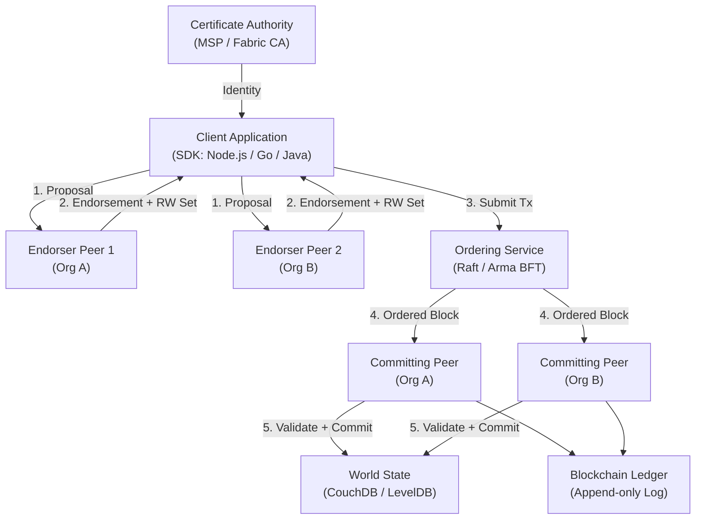
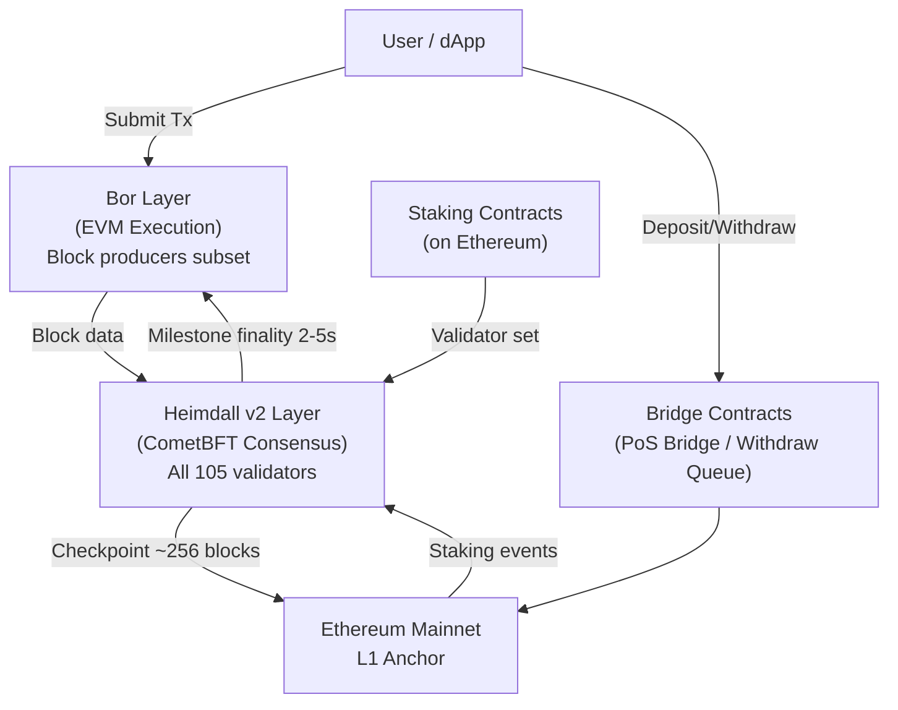
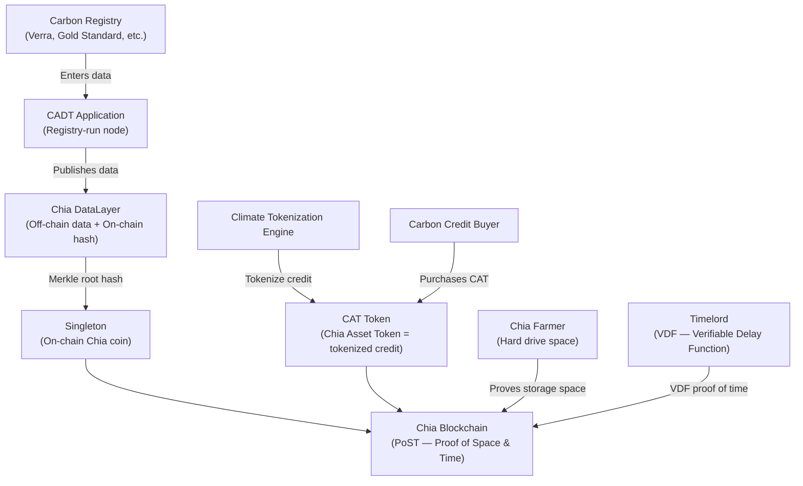
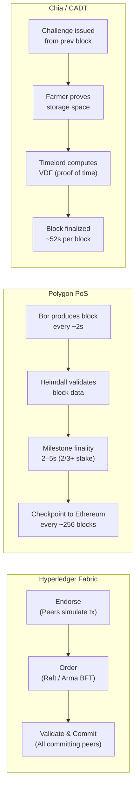
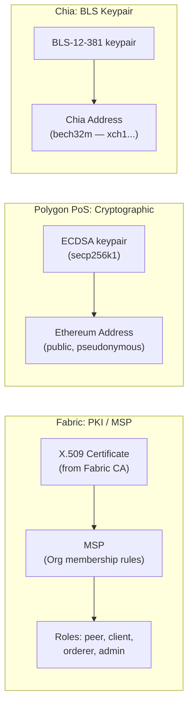
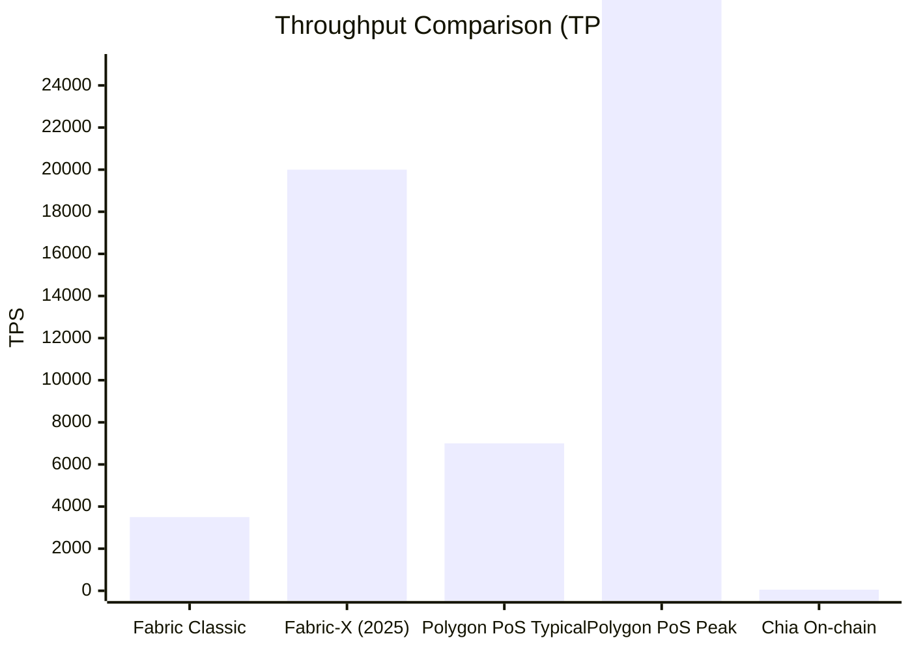
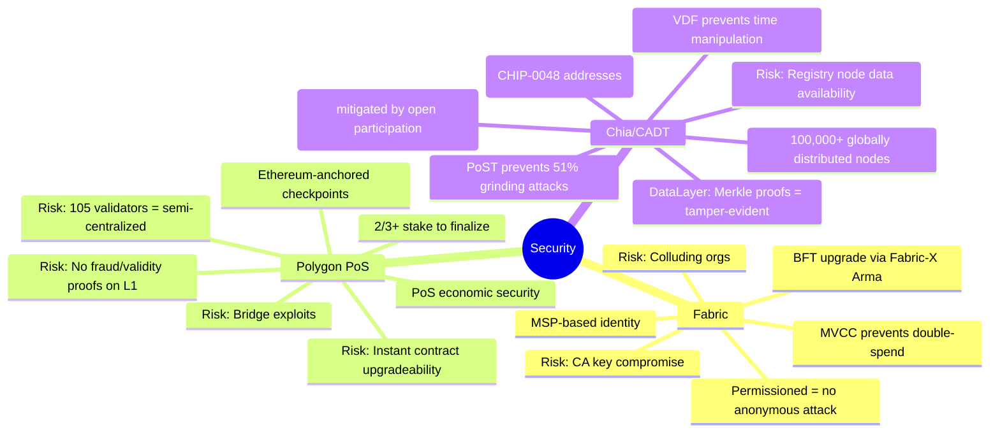
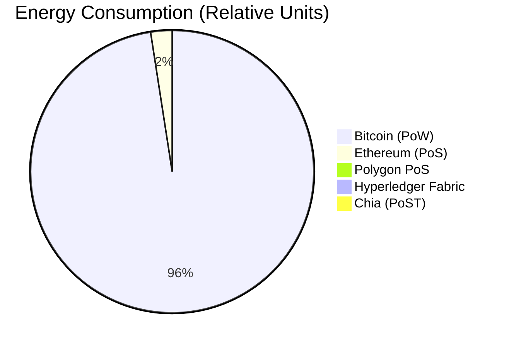
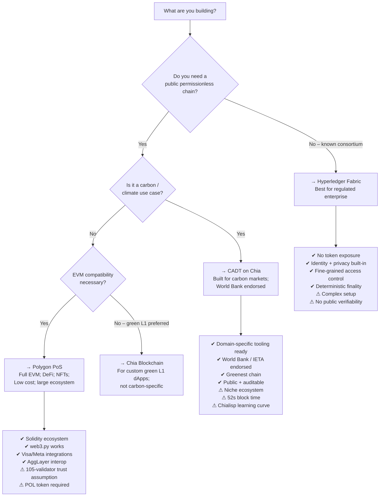

# Blockchain Platform Comparison
## Hyperledger Fabric · Polygon PoS · CADT on Chia

> A deep-dive, no-redundancy comparison for developers evaluating enterprise-grade, public Web3, and domain-specific blockchain platforms.

---

## Table of Contents

1. [At-a-Glance Summary](#1-at-a-glance-summary)
2. [What Is Each Platform?](#2-what-is-each-platform)
3. [Architecture Deep Dive](#3-architecture-deep-dive)
4. [Consensus Mechanism](#4-consensus-mechanism)
5. [Transaction Lifecycle](#5-transaction-lifecycle)
6. [Smart Contracts / On-Chain Logic](#6-smart-contracts--on-chain-logic)
7. [Data Model & Storage](#7-data-model--storage)
8. [Identity & Permissions](#8-identity--permissions)
9. [Performance & Scalability](#9-performance--scalability)
10. [Token Economics & Gas](#10-token-economics--gas)
11. [Interoperability](#11-interoperability)
12. [Security Model & Attack Vectors](#12-security-model--attack-vectors)
13. [Developer Experience](#13-developer-experience)
14. [Ecosystem & Adoption](#14-ecosystem--adoption)
15. [Environmental Impact](#15-environmental-impact)
16. [Use-Case Fit Matrix](#16-use-case-fit-matrix)
17. [Decision Guide](#17-decision-guide)

---

## 1. At-a-Glance Summary

| Dimension | Hyperledger Fabric | Polygon PoS | CADT on Chia |
|---|---|---|---|
| **Type** | Permissioned enterprise blockchain | Public EVM-compatible sidechain | Public permissionless (domain-specific layer) |
| **Consensus** | Raft CFT / Arma BFT (Fabric-X) | CometBFT (Heimdall v2) + Bor | Proof of Space and Time (PoST) |
| **Native Token** | None (no token) | POL (ERC-20) | XCH |
| **Smart Contracts** | Chaincode (Go, Node.js, Java) | Solidity / EVM bytecode | Chialisp (LISP-based) |
| **Throughput** | ~3,500 TPS (20,000+ on Fabric-X) | 65,000 TPS theoretical; ~7,000 typical | ~52 TPS on-chain; off-chain via DataLayer |
| **Finality** | ~1–2s (deterministic) | 2–5s (Heimdall v2 milestones) | ~52s block time, timelord-dependent |
| **Public/Private** | Private (permissioned) | Public (permissionless) | Public (permissionless) |
| **Primary Domain** | Enterprise: finance, supply chain, health | DeFi, NFTs, payments, gaming | Carbon markets, climate registries |
| **Governance** | Consortium / MSP-based | On-chain + Polygon governance | World Bank / IETA / Singapore-led |
| **Open Source** | Yes (Linux Foundation) | Yes (Polygon Labs) | Yes (Chia Network) |

---

## 2. What Is Each Platform?

### 2.1 Hyperledger Fabric

Hyperledger Fabric is a **permissioned, modular blockchain framework** under the Linux Foundation (now LF Decentralized Trust umbrella). It is designed for enterprises where participants are **known, authenticated identities** — not anonymous actors. Unlike Bitcoin or Ethereum, Fabric has **no native cryptocurrency** and is purely a distributed ledger platform for business logic. It is the most deployed enterprise blockchain, accounting for ~46% of permissioned deployments as of 2025.

In 2025, IBM Research contributed **Fabric-X**: a ground-up architectural rethink of classic Fabric. Fabric-X decomposes the monolithic peer into independent microservices, replaces Raft with **Arma BFT** consensus, and moves from multi-channel isolation to a single-channel-with-namespaces model, targeting 20,000+ TPS.

### 2.2 Polygon PoS

Polygon PoS is an **EVM-compatible sidechain** (not a rollup) for Ethereum. It executes transactions entirely off-chain using a set of PoS validators, and periodically anchors state summaries (checkpoints) back to Ethereum for security. It uses a **dual-layer architecture**: Heimdall (consensus) and Bor (execution). Post-MATIC-to-POL migration (99% complete by September 2025), **POL** is the native gas and staking token. Polygon PoS targets global payment rails, DeFi, NFTs, and enterprise stablecoin settlement (e.g., Visa integration).

### 2.3 CADT on Chia

CADT (Climate Action Data Trust) is **not a general-purpose blockchain** — it is a **domain-specific metadata and tokenization layer** for voluntary and compliance carbon markets, built on top of the **Chia Network** blockchain. It was launched as a partnership between the World Bank, IETA, and the Government of Singapore. CADT harmonizes carbon credit data from all major registries (Verra, Gold Standard, ACR, etc.) into a single decentralized, immutable ledger. The underlying Chia blockchain uses **Proof of Space and Time (PoST)**, a novel consensus that is radically more energy-efficient than Proof of Work.

---

## 3. Architecture Deep Dive

### 3.1 Hyperledger Fabric



**Key structural elements:**

- **Peers**: Dual-role nodes (endorsers simulate transactions; committing peers validate and write to ledger).
- **Ordering Service**: Separate component responsible only for ordering transactions into blocks — not for execution. Pluggable (Raft for CFT, Arma BFT in Fabric-X for Byzantine fault tolerance).
- **Channels**: Private sub-ledgers between subsets of organizations. Only participants on a channel can see its data.
- **MSP (Membership Service Provider)**: Every participant has an X.509 certificate issued by a CA. Identity is non-anonymous.
- **World State**: A key-value or document store (LevelDB or CouchDB) representing the current state. Separate from the append-only ledger.
- **Chaincode**: Smart contract code deployed per-channel; runs in Docker or Kubernetes sandboxes.

**Fabric-X changes (2025):**
- Peer decomposed into independent microservices (endorser, validator, committer separated).
- Arma BFT replaces Raft: pipelined consensus, partitioned ordering, 15,000–20,000+ TPS.
- Single-channel-with-namespaces replaces multi-channel topology, reducing operational complexity.

---

### 3.2 Polygon PoS



**Key structural elements:**

- **Bor (Execution Layer)**: Go-Ethereum (Geth) fork. Block producers are a rotating subset of validators selected by Heimdall each span (~64 blocks). Produces blocks every ~2 seconds.
- **Heimdall v2 (Consensus Layer)**: Built on CometBFT + Cosmos SDK. All 105 validators run this. It monitors staking events on Ethereum, proposes milestones (local finality in 2–5s), and submits checkpoints to Ethereum (~every 256 Bor blocks, ~30 min).
- **Checkpoints vs Milestones**: Milestones give fast Polygon-internal finality; checkpoints give Ethereum-anchored finality needed for L1 withdrawals.
- **Validator cap**: Hard-capped at 105 active validators. Joining requires waiting for an existing validator to exit. Stake managed via Ethereum smart contracts.
- **AggLayer (2025+)**: Polygon's vision of cross-chain interoperability — aggregates multiple chains (including sovereign PoS chains) into a unified proof layer.

---

### 3.3 CADT on Chia



**Key structural elements:**

- **Chia Blockchain**: Public, permissionless layer-1. Uses PoST not PoW or PoS.
- **Proof of Space**: Farmers pre-compute cryptographic data ("plots") on hard drives. Challenges are issued and farmers prove they allocated space.
- **Proof of Time (VDF)**: Timelords compute a Verifiable Delay Function to inject entropy and prevent grinding attacks — this is what provides time ordering without energy-intensive mining.
- **DataLayer**: A hybrid on/off-chain decentralized database. Actual data is stored off-chain on registry-operated nodes; a Merkle root hash of that data is anchored in a **singleton** on-chain. Changes create a new Merkle root → full audit history.
- **Singleton**: A Chia coin with a unique lineage ID. It can be spent and recreated (updated) while maintaining its identity. CADT uses singletons to represent each carbon project's live data record.
- **Chialisp**: Chia's on-chain programming language — a LISP dialect used to define spending conditions (not Turing-complete Solidity-style execution; conditions-based instead).
- **CAT (Chia Asset Token)**: A fungible token standard on Chia. Tokenized carbon credits are CATs — one CAT = one tonne of CO₂e.
- **CADT Architecture**: Each carbon registry runs its own CADT node. No central coordinator. Data is peer-to-peer; the on-chain anchors guarantee immutability and cross-registry transparency.

---

## 4. Consensus Mechanism



### Hyperledger Fabric — Execute-Order-Validate

Fabric uses a unique **Execute-Order-Validate** (EOV) flow, unlike all other blockchains that use Order-Execute. This allows parallel simulation before ordering, increasing throughput.

- **Classic Fabric (Raft)**: Crash Fault Tolerant (CFT). Requires honest majority. Tolerates node failures, not Byzantine actors. Suitable for trusted consortium.
- **Fabric-X (Arma BFT)**: Byzantine Fault Tolerant. Tolerates up to f < n/3 malicious nodes. Uses pipelined consensus and partitioned ordering for 15,000–20,000+ TPS.
- Finality is **deterministic** once a block is committed — no probabilistic finality or forks.

### Polygon PoS — BFT Delegated PoS

- **Heimdall v2**: CometBFT-based BFT consensus. Validators vote on milestones (Polygon finality) using vote extensions. A sequence is finalized when ≥ 2/3 of staked validators agree.
- **Bor**: A subset of validators acts as block producers in rotating spans. Block time ~2s.
- Two tiers of finality: **milestone** (Polygon-internal, 2–5s) and **checkpoint** (Ethereum-anchored, ~30min). Withdrawals to Ethereum L1 require checkpoint verification.
- **Validator cap**: 105 validators, not permissionless expansion. State is not verified on L1 — it is assumed valid if signed by 2/3 validators. No fraud or validity proofs (key risk).

### Chia — Proof of Space and Time (PoST)

PoST is a two-part, novel consensus:

1. **Proof of Space**: You allocate hard drive space by creating "plots" (large pre-computed lookup tables). The network issues a challenge; your plot either has a qualifying answer or it doesn't. More space → more chances to win blocks. No ongoing computation needed after plotting.
2. **Proof of Time (VDF)**: After a space proof is found, a Timelord computes a Verifiable Delay Function — a computation that cannot be parallelized and takes a minimum real-world time. This prevents grinding attacks (trying many space proofs rapidly). Only one Timelord needs to finish per block.

**Key difference from PoW**: No ongoing energy waste. Hard drives idle between challenges. Chia uses ~1/600th the energy footprint of comparable PoW/PoS blockchains per the Chia Network.

**Key difference from PoS**: No token staking required to participate. Anyone with a hard drive can farm. Lower Nakamoto coefficient risk from capital concentration.

> **CHIP-0048 (2025)**: Chia proposed a new PoS protocol with a "Quality Chain" mechanism to address compressed plot vulnerabilities and reduce energy from optimized farming further.

---

## 5. Transaction Lifecycle

### Hyperledger Fabric

```
1. Client constructs a transaction proposal (specifying chaincode + args)
2. Client sends proposal to required endorsing peers (per endorsement policy)
3. Endorsers simulate chaincode execution → generate Read-Write (RW) sets
4. Endorsers sign and return endorsement responses
5. Client verifies enough endorsements are collected
6. Client assembles transaction (proposal + endorsements) → submits to Ordering Service
7. Ordering Service batches transactions → creates a block (Raft/Arma BFT ordering)
8. Block distributed to all committing peers via gossip
9. Each committing peer: (a) validates endorsements, (b) checks MVCC conflicts in RW sets, (c) commits or marks invalid
10. World State updated; ledger appended
```

All steps are synchronous-style from the client's perspective. MVCC (Multi-Version Concurrency Control) is used — if a read key changed between endorsement and commit, the transaction is marked invalid.

### Polygon PoS

```
1. User signs and broadcasts EVM transaction (EOA or smart contract call)
2. Bor block producer picks up tx from mempool
3. Block producer executes tx against EVM state → updates state trie
4. Block produced ~every 2s; gossipped to other Bor nodes
5. Heimdall validators observe Bor blocks; vote on milestone (2/3+ stake needed)
6. Milestone reached → Polygon-internal finality (2–5s)
7. Every ~256 Bor blocks, Heimdall submits a Merkle root checkpoint to Ethereum L1
8. For L2→L1 withdrawals: user waits for checkpoint inclusion (~30 min), then submits exit proof on Ethereum
```

### CADT on Chia (Data Publishing)

```
1. Registry operator updates project data in their CADT node (REST API or UI)
2. CADT node syncs changes to Chia DataLayer (local off-chain store updated)
3. DataLayer computes a new Merkle root of the updated dataset
4. CADT creates an on-chain Chia transaction updating the singleton coin with new Merkle root
5. Transaction broadcast to Chia network; included in a block (~52s block time)
6. Other CADT nodes sync the data; independently verify Merkle root matches on-chain singleton
7. Any observer can verify data integrity without trusting any single registry
```

### CADT on Chia (Credit Tokenization)

```
1. Registry uses Climate Tokenization Engine connected to their CADT node
2. Specifies which carbon units (from CADT) to tokenize
3. Engine creates a CAT (Chia Asset Token) issuance transaction
4. CAT is broadcast to Chia blockchain; one CAT = one tonne CO₂e
5. CAT transferable peer-to-peer; retirement recorded on-chain (coin permanently spent)
6. Chia Offers enable atomic, trustless peer-to-peer trading of CATs (no exchange needed)
```

---

## 6. Smart Contracts / On-Chain Logic

| Aspect | Hyperledger Fabric | Polygon PoS | CADT / Chia |
|---|---|---|---|
| **Name** | Chaincode | Smart Contract (Solidity) | Chialisp puzzle |
| **Language** | Go, Node.js, Java | Solidity, Vyper, Yul | Chialisp (LISP) |
| **Execution Model** | Off-chain simulation → on-chain commit | On-chain EVM execution | Coin puzzle evaluation at spend time |
| **Turing Complete?** | Yes (full language runtimes) | Yes (EVM) | No (intentionally constrained; conditions-based) |
| **Deployment** | `peer chaincode install` + instantiate per channel | `eth_sendTransaction` to deploy bytecode | Puzzle committed to coin at creation |
| **Upgradability** | Explicit versioned upgrade process (lifecycle) | Proxy patterns or re-deploy | New puzzle on new coin; old coin unspendable |
| **Gas / Fees** | No gas (consortium bears cost) | POL-denominated gas; sub-$0.001 typical | XCH fee (very low; ~0.00001 XCH) |
| **State model** | Key-value World State + RW sets | Account model (storage slots) | Coin/UTXO-like model |
| **Runtime sandbox** | Docker / Kubernetes | EVM | Clvm (Chia Lisp VM) |

**Chialisp note for developers**: Unlike Solidity's mutable account model, Chia uses a **coin model** (similar to Bitcoin's UTXO). Every coin has a puzzle (code) and a solution (input). A coin is spent by providing a solution that satisfies the puzzle. Smart contracts are written as spending conditions, not stored mutable state machines. This makes formal verification easier and eliminates re-entrancy attacks by design.

---

## 7. Data Model & Storage

### Hyperledger Fabric

- **World State**: CouchDB (JSON documents, rich queries) or LevelDB (key-value). Reflects current state only.
- **Blockchain Ledger**: Append-only log of all transaction blocks. Full history.
- **Private Data Collections**: Hashed data on public ledger; actual data shared only among authorized organizations via off-chain gossip. Enables privacy within a shared channel.
- **Channels**: Full ledger isolation between channel participants. A peer can join multiple channels, each with separate state.

### Polygon PoS

- **EVM State Trie**: Merkle Patricia Trie. Every account (EOA or contract) has a balance, nonce, code hash, and storage root. Contract storage is also a Merkle Patricia Trie of 256-bit slot → 256-bit value mappings.
- **Transaction receipts**: Bloom filters + logs for event indexing.
- **No built-in privacy**: All state is publicly visible. Privacy requires application-level solutions (ZK proofs, off-chain computation).
- **Historical data**: Requires archive node. Full nodes prune state.

### CADT / Chia DataLayer

- **On-chain**: Only Merkle root hashes (in singletons). Extremely lightweight on-chain footprint.
- **Off-chain**: Full dataset lives in the registry operator's DataLayer node. Mirrors available to subscribers.
- **DataLayer singletons**: A singleton is a unique on-chain coin lineage. Its current hash represents the current state of the off-chain dataset. All prior hashes (history) remain on-chain — permanent, immutable audit trail.
- **Proof of inclusion**: Any third party can verify a specific record is in the dataset without downloading the full dataset, using a Merkle inclusion proof.
- **Subscriptions**: Other CADT nodes subscribe to a registry's DataLayer store → automatically mirror data → verify against on-chain hashes.

---

## 8. Identity & Permissions



**Hyperledger Fabric**: Strongest identity model. Every actor must have an X.509 cert from a trusted CA enrolled in an MSP. MSPs define which CAs are trusted per organization. Roles (peer, client, admin, orderer) are cert-attribute-based. Attribute-Based Access Control (ABAC) can enforce fine-grained authorization in chaincode. **No anonymity** — all identities traceable.

**Polygon PoS**: Ethereum-style pseudonymous identity. A wallet is an ECDSA keypair; address is the last 20 bytes of the keccak256 hash of the public key. Anyone can generate a wallet with no registration. All transactions publicly visible and linked to the address. dApps add on-chain KYC/access control if needed.

**CADT / Chia**: BLS-12-381 signature scheme (allows signature aggregation). Chia addresses are bech32m-encoded. CADT access: registry operators control their DataLayer node and who can write. Reading CADT data is public (anyone can verify). Writing requires operator keys. The Chia blockchain itself is fully permissionless to read and transact on.

---

## 9. Performance & Scalability



| Metric | Hyperledger Fabric | Polygon PoS | Chia / CADT |
|---|---|---|---|
| **Throughput** | ~3,500 TPS (classic); 20,000+ (Fabric-X) | ~7,000 TPS typical; 65,000 TPS theoretical | ~52 TPS on-chain |
| **Latency / Finality** | 1–2s (deterministic) | 2–5s (milestone); ~30min (Ethereum checkpoint) | ~52s block time |
| **Scalability approach** | Channels (data isolation); Fabric-X (microservices + Arma BFT) | AggLayer (cross-chain aggregation); upcoming Bhilai upgrade (100k+ TPS target by 2026) | DataLayer (off-chain with on-chain proofs) bypasses on-chain TPS limit |
| **Bottlenecks** | MVCC conflicts under contention; gossip overhead | 105-validator cap (semi-centralized); no fraud/validity proofs on L1 | ~52s on-chain finality; timelord dependency |
| **Horizontal scaling** | Fabric-X: namespaces + microservices replace multi-channel complexity | Add sovereign chains under AggLayer | DataLayer nodes scale independently |

**Important context for CADT**: The ~52 TPS on-chain limit is not a practical bottleneck for carbon market use. CADT writes are infrequent (registry data updates, tokenization events). The real throughput is in the off-chain DataLayer synchronization which is not TPS-bound.

---

## 10. Token Economics & Gas

### Hyperledger Fabric — No Token

Fabric has no native token. This is intentional for enterprise use:
- Network operation costs are shared by consortium members.
- No cryptocurrency exposure or volatility.
- No gas fees on transactions.
- Organizations deploy and maintain infrastructure directly.

### Polygon PoS — POL Token

- **Migration**: MATIC → POL completed (99% migrated, September 2025). All gas on Polygon PoS now paid in POL.
- **POL supply**: 10 billion POL total, inflationary emission split between validators (staking rewards) and a protocol treasury.
- **"Hyperproductive" token**: POL can stake on Polygon PoS and also on other chains in the AggLayer ecosystem — validators earn multi-chain rewards.
- **Gas cost**: Sub-$0.001 typical. Target: < $0.001 per tx even at 1,000+ TPS (Bhilai upgrade goal).
- **Staking**: Validators lock POL on Ethereum staking contracts. Delegators can also stake via validator shares. Minimum stake is enforced; 105 active validator cap.
- **Governance**: POL holders vote on protocol upgrades via Polygon Improvement Proposals (PIPs).

### Chia — XCH

- **Purpose**: Transaction fees, collateral in DeFi, issuance fees for CATs.
- **Supply**: Pre-mined strategic reserve + block rewards to farmers. Halving schedule similar to Bitcoin but gentler.
- **Fees for CADT**: Minimal. Updating a DataLayer singleton costs a fraction of XCH (~0.00001 XCH). Tokenizing a carbon credit as a CAT also incurs a small XCH fee.
- **No staking**: Farmers earn XCH by winning block rewards (farming). No minimum capital requirement — participation proportional to hard drive space committed.

---

## 11. Interoperability

### Hyperledger Fabric

- **Cross-chain**: Limited native support. Requires middleware (e.g., Weave interop framework, custom relay chains, or Cactus — a Hyperledger cross-chain connector toolkit).
- **Off-chain systems**: Excellent. REST APIs, event listeners (Fabric SDK), and database integrations are first-class.
- **Standards**: IATA, ISO 20022, and GS1 supply chain standards have been implemented on Fabric.
- **Fabric-X**: Introduces improved cross-namespace and modular service composition.

### Polygon PoS

- **EVM Compatibility**: Full. Any Ethereum contract can be deployed 1:1. Hardhat, Foundry, Remix — all work.
- **Bridges**: PoS Bridge (canonical) for ERC-20/721 to Ethereum. Also integrated with LayerZero, Axelar, Connext, and other cross-chain messaging protocols.
- **AggLayer**: Polygon's vision of unified cross-L2 interoperability — aggregates multiple chains' proofs and state into a single ZK-proof submitted to Ethereum. Enables trustless L2-to-L2 transfers without going through L1.
- **Ecosystem**: Thousands of dApps. Visa, Meta (creator payments), Stripe payment rails.

### CADT / Chia

- **Carbon registries**: Designed to interoperate across all major registries — Verra, Gold Standard, ACR, CAR, etc. — as a neutral aggregation layer.
- **Article 6 (Paris Agreement)**: CADT's common data model aligns with UNFCCC Article 6 corresponding adjustment requirements, enabling country-level sovereign trading.
- **CAT tokens**: Can be bridged to EVM chains via custom bridge logic. Atomic swaps of CATs are native (Chia Offers).
- **Chia ↔ EVM bridges**: Exist but less mature than EVM-native bridges.
- **DataLayer subscriptions**: Any system can subscribe to a CADT DataLayer feed and mirror data — open API.

---

## 12. Security Model & Attack Vectors



**Hyperledger Fabric:**
- Permissioned model eliminates anonymous Sybil attacks.
- CA key compromise is the primary systemic risk.
- Endorsement policies prevent single-org unilateral transaction approval.
- MVCC at commit phase prevents read-write conflicts (but can cause high abort rates under contention).
- Classic Fabric (Raft) is NOT BFT — colluding ordering nodes can fork the chain. Fabric-X (Arma BFT) fixes this.

**Polygon PoS:**
- Economic security: attacking the network requires acquiring >1/3 of staked POL.
- Critical: Polygon PoS has **no fraud proofs or validity proofs** submitted to Ethereum. L1 only verifies that the checkpoint is signed by 2/3+ validators. A colluding majority could submit invalid state. L2Beat classifies this as a medium-risk trust assumption.
- Instant contract upgradeability (no exit window for users) — a governance risk.
- Historical bridge exploits across the EVM ecosystem are a systemic concern.
- Validator cap of 105 creates a more concentrated validator set than fully permissionless PoW/PoS chains.

**Chia / CADT:**
- Over 100,000 full nodes globally — one of the most decentralized chains by node count.
- PoST prevents grinding attacks: VDF forces real time between block attempts.
- DataLayer: Merkle roots on-chain make data tampering detectable even if an individual registry node is compromised.
- Risk: If a CADT registry node goes offline, its DataLayer data becomes unavailable (though on-chain hashes persist). Mitigated by subscriber mirrors.
- Compressed plot attacks (allowing faster-than-expected farming) addressed by CHIP-0048 new PoS format.

---

## 13. Developer Experience

### Hyperledger Fabric

**Learning curve**: Steep. Requires understanding MSPs, CAs, channels, endorsement policies, and ordering service topology before writing any business logic.

**Toolchain:**
- Fabric SDK: Go, Node.js, Java
- Chaincode: Go (most popular), Node.js, Java
- Local dev: `fabric-samples` with Docker Compose
- Test network: `test-network` script spins up a local 2-org Fabric network
- Deployment: Kubernetes (HLF Operator recommended for production)

**For Python developers**: No official Python SDK. Use the `grpc` library to interact with Fabric gateways, or wrap Node.js/Go SDKs via subprocess calls. Alternatively, use Fabric's REST API gateway (available in Fabric 2.4+).

```python
# Example: Call a Fabric REST gateway (Fabric 2.4+)
import requests, json

headers = {"Content-Type": "application/json", "Authorization": "Bearer <JWT>"}
payload = {
    "function": "CreateAsset",
    "args": ["asset1", "red", "10", "Tom", "1300"]
}
resp = requests.post("https://fabric-gateway/api/v1/transactions", 
                     headers=headers, data=json.dumps(payload))
print(resp.json())
```

### Polygon PoS

**Learning curve**: Moderate for Ethereum developers. Very accessible for new Web3 developers via EVM tooling.

**Toolchain:**
- Hardhat / Foundry for contract development and testing
- ethers.js / viem / web3.py for interaction
- Polygon Mumbai testnet → Amoy testnet (current)
- Remix IDE for quick prototyping
- The Graph for indexing events

**For Python developers**: `web3.py` works natively with Polygon PoS (same interface as Ethereum).

```python
from web3 import Web3

w3 = Web3(Web3.HTTPProvider("https://polygon-rpc.com"))
contract = w3.eth.contract(address="0x...", abi=ABI)

# Read
result = contract.functions.balanceOf("0xYourAddress").call()

# Write (requires signing)
tx = contract.functions.transfer("0xRecipient", 100).build_transaction({
    "from": "0xYourAddress",
    "nonce": w3.eth.get_transaction_count("0xYourAddress"),
    "gas": 200000,
    "gasPrice": w3.to_wei("30", "gwei"),
})
signed = w3.eth.account.sign_transaction(tx, private_key="0x...")
w3.eth.send_raw_transaction(signed.rawTransaction)
```

### CADT / Chia

**Learning curve**: Moderate for CADT's REST API; steep for native Chialisp development.

**Toolchain:**
- CADT REST API (registry operators interact here — well-documented JSON API)
- Chia Python SDK (`chia-blockchain` Python package) for wallet/node interaction
- Chialisp for low-level puzzle development (very different from Solidity)
- Climate Tokenization Engine CLI for credit tokenization

**For Python developers**: Chia's primary SDK is Python-first, which is great.

```python
# Using Chia Python SDK to get wallet balance
from chia.rpc.wallet_rpc_client import WalletRpcClient
from chia.util.config import load_config
import asyncio

async def get_balance():
    config = load_config("~/.chia/mainnet", "config.yaml")
    client = await WalletRpcClient.create("localhost", 9256, "~/.chia/mainnet", config)
    balance = await client.get_wallet_balance(1)  # wallet_id=1
    print(f"Balance: {balance['confirmed_wallet_balance'] / 1e12} XCH")
    client.close()

asyncio.run(get_balance())
```

```python
# Calling CADT REST API to list projects
import requests

resp = requests.get("http://localhost:31310/v1/projects", 
                    params={"page": 1, "limit": 10})
projects = resp.json()
```

---

## 14. Ecosystem & Adoption

### Hyperledger Fabric

- **46% of permissioned enterprise blockchain deployments** (Hyperledger Foundation, 2025).
- Major adopters: IBM Food Trust (supply chain), TradeLens (shipping), we.trade (trade finance), SWIFT GPI, multiple CBDC pilots (e.g., digital yuan research).
- Active enterprise blockchain vendors: IBM, Oracle, AWS Managed Blockchain, Azure Blockchain Service.
- Mature ecosystem for regulated industries: healthcare (MedRec), insurance (Aetna), government.
- **Fabric-X** signals continued investment from IBM Research and Linux Foundation through 2025+.

### Polygon PoS

- One of the largest Web3 ecosystems. Thousands of deployed dApps.
- **Visa** integrated Polygon for stablecoin settlement (2025).
- **Meta** uses Polygon (and Solana) for creator payments in USDC (Colombia, Philippines).
- **Stripe** uses Polygon for payment infrastructure.
- DeFi TVL: Several billion USD across Aave, Uniswap, QuickSwap, Curve on Polygon.
- NFT ecosystem: OpenSea, Rarible, and major gaming NFT projects.
- 105 active validators; top stakers include Binance, Coinbase, Twinstake, Luganodes.

### CADT / Chia

- Launched by **World Bank**, **IETA**, **Singapore government**.
- Integrates major registries: Verra (VCS), Gold Standard, American Carbon Registry (ACR), Climate Action Reserve (CAR).
- First live tokenized carbon credit transactions: Carbon Opportunities Fund + Sumitomo Corporation (SCOA) purchasing CATs on Chia blockchain.
- Chia Network completed **SOC 2 Type II** audit (September 2025), validating infrastructure for enterprise use.
- Over **100,000 nodes** globally.
- Still early-stage for broad market adoption; CADT is the reference implementation for Article 6 digital MRV (Measurement, Reporting, Verification).

---

## 15. Environmental Impact



| Platform | Consensus | Energy Profile |
|---|---|---|
| **Hyperledger Fabric** | BFT / Raft | Very low — no mining, no staking compute. Server infrastructure only. Datacenter-dependent. |
| **Polygon PoS** | Delegated PoS (CometBFT) | Low. PoS has ~99% less energy than PoW. 105 validators running nodes. |
| **Chia (CADT)** | Proof of Space and Time | Extremely low. Hard drives idle between challenges. ~1/600th the footprint of comparable blockchains per Chia Network. |

Chia's PoST is intentionally the **greenest** Layer-1 architecture. CADT chose Chia partly for this reason — a carbon market platform should not run on energy-intensive infrastructure.

Fabric's low energy footprint comes from its permissioned design: a small set of known nodes, no competitive mining, no large validator sets.

---

## 16. Use-Case Fit Matrix

| Use Case | Fabric | Polygon PoS | CADT/Chia |
|---|---|---|---|
| Enterprise supply chain | ✅ Best fit | ⚠️ Possible (public) | ❌ Not designed for this |
| CBDC / regulated payments | ✅ Best fit | ⚠️ Possible with compliance layer | ❌ Not designed for this |
| DeFi (lending, DEX, yield) | ❌ No token / no DeFi ecosystem | ✅ Best fit | ⚠️ Limited (CAT swaps) |
| NFTs / digital collectibles | ❌ Not typical | ✅ Best fit | ⚠️ Possible (Chia NFTs exist) |
| Carbon credit registries | ❌ Overkill, no public verifiability | ⚠️ Possible but no domain tools | ✅ Best fit |
| Carbon credit tokenization | ❌ | ⚠️ Possible (custom) | ✅ Best fit (CATs, CADT) |
| Cross-registry data harmonization | ❌ | ❌ | ✅ Only option with live deployment |
| Article 6 compliance MRV | ❌ | ❌ | ✅ Designed for this |
| Consortium data sharing | ✅ Best fit | ⚠️ Possible | ⚠️ CADT is a narrow form of this |
| Anonymous public transactions | ❌ Impossible (permissioned) | ✅ Yes | ✅ Yes |
| High-frequency trading (DeFi) | ❌ | ✅ | ❌ |
| GameFi / on-chain gaming | ❌ | ✅ Best fit | ❌ |
| Data provenance / audit trails | ✅ | ⚠️ | ✅ (DataLayer) |
| No token / no crypto required | ✅ | ❌ Requires POL | ❌ Requires XCH (minimal) |
| Government / sovereign use | ✅ | ⚠️ | ✅ (World Bank governed) |

---

## 17. Decision Guide



### Quick Reference

**Choose Hyperledger Fabric if:**
- Your participants are known, legal entities (no anonymous actors).
- You need no cryptocurrency exposure — pure enterprise application.
- Privacy between organizations is mandatory (channels, private data collections).
- You operate in a regulated industry (finance, healthcare, government).
- You can tolerate operational complexity in exchange for fine-grained control.

**Choose Polygon PoS if:**
- You need EVM compatibility and Solidity tooling.
- You're building DeFi, NFTs, gaming, or high-frequency Web3 dApps.
- Low transaction fees and large existing ecosystem matter.
- You want Python + `web3.py` development (easiest Web3 entry for Python devs).
- You're comfortable with a trust assumption on the 105-validator set.

**Choose CADT on Chia if:**
- Your application is a carbon market, climate registry, or Article 6 compliance tool.
- You need cross-registry data harmonization out of the box.
- Green credentials and energy efficiency are part of your product narrative.
- You want World Bank / IETA governance and standards alignment.
- You need long-term immutable audit trails for climate data.

---

## Appendix: Key Terminology

| Term | Definition |
|---|---|
| **MSP** | Membership Service Provider — Fabric's identity framework mapping X.509 certs to org membership |
| **Chaincode** | Fabric's smart contract, deployed per-channel, runs in Docker/K8s sandbox |
| **Raft** | Crash Fault Tolerant consensus (majority honesty assumed; no Byzantine tolerance) |
| **BFT** | Byzantine Fault Tolerant — tolerates actively malicious nodes up to 1/3 of total |
| **Arma** | Fabric-X's new BFT consensus; pipelined; 15,000+ TPS |
| **Heimdall** | Polygon's consensus layer (CometBFT); all 105 validators participate |
| **Bor** | Polygon's execution layer (Go-Ethereum fork); rotating block producer subset |
| **Milestone** | Polygon-internal finality event (2–5s); does not require Ethereum checkpoint |
| **Checkpoint** | Merkle root of Bor blocks submitted to Ethereum L1; required for L1 withdrawals |
| **POL** | Polygon's native token (replaced MATIC 2024); gas + staking + governance |
| **PoST** | Proof of Space and Time — Chia's consensus; uses hard drive space + VDF |
| **VDF** | Verifiable Delay Function — computation that takes minimum real-world time; provides time ordering |
| **Plot** | Pre-computed cryptographic lookup table stored on a farmer's hard drive |
| **Singleton** | Unique on-chain Chia coin lineage; used to anchor DataLayer Merkle roots |
| **CAT** | Chia Asset Token — fungible token standard; used for tokenized carbon credits |
| **DataLayer** | Chia's hybrid on/off-chain decentralized database; hashes on-chain, data off-chain |
| **CADT** | Climate Action Data Trust — carbon registry harmonization platform on Chia |
| **Chialisp** | Chia's on-chain language; LISP-based, conditions-driven, not Turing-complete |
| **AggLayer** | Polygon's cross-chain aggregation layer — unifies multiple L2/sovereign chains |
| **MVCC** | Multi-Version Concurrency Control — Fabric's mechanism to detect RW set conflicts at commit time |

---

*Last updated: May 2026 | Sources: Hyperledger Foundation, Polygon Developer Docs, Chia Network, L2Beat, World Bank CADT documentation*
