# Blockchain Platform Comparison
## Hyperledger Fabric · Polygon PoS · CADT on Chia

> A professional, no-redundancy reference comparing an enterprise permissioned blockchain, a public EVM sidechain, and a domain-specific climate data platform — across architecture, consensus, security, performance, and fit.

---

## Table of Contents

1. [At-a-Glance](#1-at-a-glance)
2. [Platform Overviews](#2-platform-overviews)
3. [Architecture](#3-architecture)
4. [Consensus Mechanisms](#4-consensus-mechanisms)
5. [Transaction Lifecycle](#5-transaction-lifecycle)
6. [On-Chain Logic & Data Model](#6-on-chain-logic--data-model)
7. [Identity & Access Control](#7-identity--access-control)
8. [Performance & Scalability](#8-performance--scalability)
9. [Token Economics](#9-token-economics)
10. [Security Model](#10-security-model)
11. [Interoperability](#11-interoperability)
12. [Environmental Impact](#12-environmental-impact)
13. [Ecosystem & Adoption](#13-ecosystem--adoption)
14. [Use-Case Fit Matrix](#14-use-case-fit-matrix)
15. [Decision Guide](#15-decision-guide)
16. [Glossary](#16-glossary)

---

## 1. At-a-Glance

| Dimension | Hyperledger Fabric | Polygon PoS | CADT on Chia |
|---|---|---|---|
| **Type** | Permissioned enterprise blockchain | Public EVM-compatible sidechain | Domain-specific climate data platform |
| **Consensus** | Raft (CFT) / Arma BFT (Fabric-X) | CometBFT (Heimdall v2) + Bor | Proof of Space and Time (PoST) |
| **Native Token** | None | POL | XCH |
| **On-chain Logic** | Chaincode (Go, Node.js, Java) | Solidity / EVM | Chialisp (conditions-based) |
| **Throughput** | ~3,500 TPS; 20,000+ (Fabric-X) | ~7,000 typical; 65,000 peak | ~52 TPS on-chain (DataLayer is off-chain) |
| **Finality** | 1–2s (deterministic) | 2–5s (milestone) | ~52s block time |
| **Access Model** | Permissioned — known identities only | Permissionless — public | Permissionless — public |
| **Primary Domain** | Enterprise: finance, supply chain, health | DeFi, NFTs, payments, gaming | Carbon markets, climate registries |
| **Governance** | Consortium / MSP-based | On-chain via POL holders | World Bank / IETA / Singapore |
| **Open Source** | Yes — Linux Foundation | Yes — Polygon Labs | Yes — Chia Network |

---

## 2. Platform Overviews

### Hyperledger Fabric

Hyperledger Fabric is a **permissioned, modular enterprise blockchain framework** maintained under the Linux Foundation's LF Decentralized Trust umbrella. It is built for environments where every participant is a **known, legally identifiable entity** — not an anonymous actor. There is no native cryptocurrency; the platform exists purely to execute and record business logic between organizations.

Fabric is the most deployed enterprise blockchain globally, accounting for approximately 46% of permissioned deployments as of 2025. Its Execute-Order-Validate architecture — unique among blockchains — allows parallel transaction simulation before ordering, which significantly improves throughput over classical Order-Execute systems.

In 2025, IBM Research contributed **Fabric-X**: a ground-up rethink that decomposes the monolithic peer node into independent microservices, replaces Raft with **Arma BFT** (Byzantine Fault Tolerant consensus), and consolidates multi-channel complexity into a single-channel-with-namespaces model. Early benchmarks show 20,000+ TPS.

---

### Polygon PoS

Polygon PoS is a **public, EVM-compatible sidechain** for Ethereum. It executes transactions entirely off-chain via a set of Proof-of-Stake validators, and periodically anchors state summaries (checkpoints) back to Ethereum as a security layer. It operates a **dual-layer architecture**: Heimdall handles consensus and Bor handles EVM execution.

Following the MATIC-to-POL token migration (99% complete by September 2025), **POL** is now the network's gas and staking token. Polygon PoS is designed for high-throughput, low-cost public Web3 applications — from DeFi and NFTs to enterprise stablecoin settlement. Major integrations include Visa, Meta (creator payments), and Stripe.

---

### CADT on Chia

The Climate Action Data Trust (CADT) is **not a general-purpose blockchain** — it is a **domain-specific metadata and tokenization layer** for global carbon markets, built on top of the Chia Network blockchain. It was established through a partnership between the **World Bank, IETA (International Emissions Trading Association), and the Government of Singapore**.

CADT harmonizes carbon credit data across all major registries (Verra, Gold Standard, ACR, CAR) into a single decentralized, publicly auditable ledger — without requiring those registries to use blockchain natively. The underlying Chia blockchain uses **Proof of Space and Time (PoST)**: a consensus mechanism that uses allocated hard drive space rather than computation or capital, making it the greenest Layer-1 blockchain by energy footprint.

---

## 3. Architecture

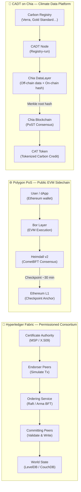

### Fabric: Execute-Order-Validate

Fabric's architecture is unique in blockchain. Rather than executing every transaction on every node, it separates execution (endorsement), ordering, and validation into distinct phases handled by distinct node types. This enables **parallelism and privacy** unavailable in conventional blockchain designs.

- **Endorser Peers** simulate transactions and return signed Read-Write sets, without modifying any state.
- **Ordering Service** takes endorsed transactions and produces deterministically ordered blocks — it does not execute or validate any logic.
- **Committing Peers** receive ordered blocks, validate MVCC consistency (detecting read conflicts), and write to the ledger and World State.
- **Channels** provide full ledger isolation between subsets of organizations — each channel is an independent blockchain.
- **Private Data Collections** allow sensitive data to be shared peer-to-peer off-ledger, with only a hash on the public channel.

### Polygon PoS: Dual-Layer Sidechain

Polygon separates consensus from execution into two cooperating layers:

- **Bor (Execution Layer)** is a fork of Go-Ethereum. A rotating subset of validators produces blocks every ~2 seconds, executing EVM transactions.
- **Heimdall v2 (Consensus Layer)** is built on CometBFT. All 105 validators participate here. It monitors Ethereum staking contracts, proposes **milestones** (Polygon-internal finality in 2–5s), and submits **checkpoints** (Merkle roots of Bor block data) to Ethereum approximately every 256 blocks.
- Milestones finalize state *on* Polygon; checkpoints enable asset *withdrawals to* Ethereum. Only the latter requires waiting ~30 minutes.

### CADT / Chia: Hybrid On/Off-Chain Architecture

Chia's DataLayer is the architectural backbone of CADT:

- **Off-chain**: Actual carbon project data (MRV records, issuances, retirements) lives in each registry's CADT node. Other nodes subscribe and mirror this data.
- **On-chain**: Only a **Merkle root hash** of that data is anchored inside a **singleton coin** on the Chia blockchain. Any change to the data produces a new Merkle root — creating a permanent, tamper-evident audit trail.
- **CAT (Chia Asset Token)**: One CAT = one tonne of CO₂e. Carbon credits are tokenized via the Climate Tokenization Engine. CATs can be traded peer-to-peer atomically via **Chia Offers** (no exchange required).

---

## 4. Consensus Mechanisms

```mermaid
flowchart TD
    subgraph F["Hyperledger Fabric — Execute-Order-Validate"]
        F1["Endorse\nPeers simulate tx → RW sets"]
        F2["Order\nRaft or Arma BFT batches into blocks"]
        F3["Validate & Commit\nMVCC check → ledger write"]
        F1 --> F2 --> F3
    end

    subgraph P["Polygon PoS — BFT Delegated PoS"]
        P1["Bor produces block\nevery ~2s"]
        P2["Heimdall validates block data\n(CometBFT, all 105 validators)"]
        P3["Milestone finality\n2–5s when 2/3+ stake agrees"]
        P4["Checkpoint to Ethereum\nevery ~256 blocks (~30 min)"]
        P1 --> P2 --> P3 --> P4
    end

    subgraph C["Chia — Proof of Space and Time"]
        C1["Challenge issued\nfrom previous block hash"]
        C2["Farmer proves allocated\nstorage space via plot lookup"]
        C3["Timelord computes VDF\n(Verifiable Delay Function)"]
        C4["Block finalized\n~52s per block"]
        C1 --> C2 --> C3 --> C4
    end
```

### Hyperledger Fabric

Fabric offers a **pluggable** consensus layer — the ordering service can be swapped independently of the rest of the network.

- **Raft** (current production default): Crash Fault Tolerant. Assumes all orderers are honest but may fail. Suitable for trusted enterprise consortia where Byzantine (malicious) behavior is not a concern.
- **Arma BFT** (Fabric-X, 2025): Byzantine Fault Tolerant. Tolerates up to f < n/3 actively malicious orderer nodes. Uses pipelined consensus and partitioned ordering, reaching 15,000–20,000+ TPS.
- Finality is **deterministic** — once a block is committed, it cannot be reversed. No probabilistic finality, no forks.

### Polygon PoS

Polygon uses a **two-tier BFT Delegated Proof-of-Stake** model. Validators stake POL tokens on Ethereum contracts; the active set is capped at 105 and is stake-weighted. CometBFT on Heimdall v2 finalizes a block sequence when ≥ 2/3 of staked validators vote for it. **Milestone** finality (2–5s) is sufficient for dApp interactions. **Checkpoint** finality (~30 min) is required for cross-chain withdrawals to Ethereum. Critically, finality is **not verified on Ethereum** — L1 only checks that a checkpoint carries the required validator signatures, without validating underlying state transitions.

### Chia — Proof of Space and Time

PoST is the most architecturally novel of the three — a two-part mechanism:

- **Proof of Space**: Participants ("farmers") pre-compute large lookup tables called "plots" stored on hard drives. When the network issues a challenge, farmers check whether their plots contain a qualifying proof. More storage = more chances to win a block. No ongoing computation after plotting.
- **Proof of Time (VDF)**: After a valid space proof is found, a Timelord computes a Verifiable Delay Function — a sequential computation that cannot be parallelized and requires minimum real-world elapsed time. This prevents grinding attacks (rapidly testing alternative proofs to game the system).

Key distinctions: unlike PoW, there is no ongoing energy expenditure — hard drives idle between challenges. Unlike PoS, there is no minimum token stake — participation is proportional to committed storage, lowering capital barriers to entry.

---

## 5. Transaction Lifecycle

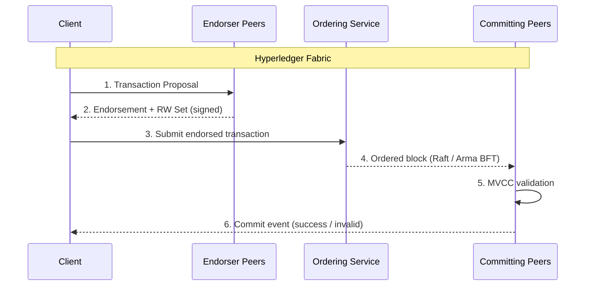

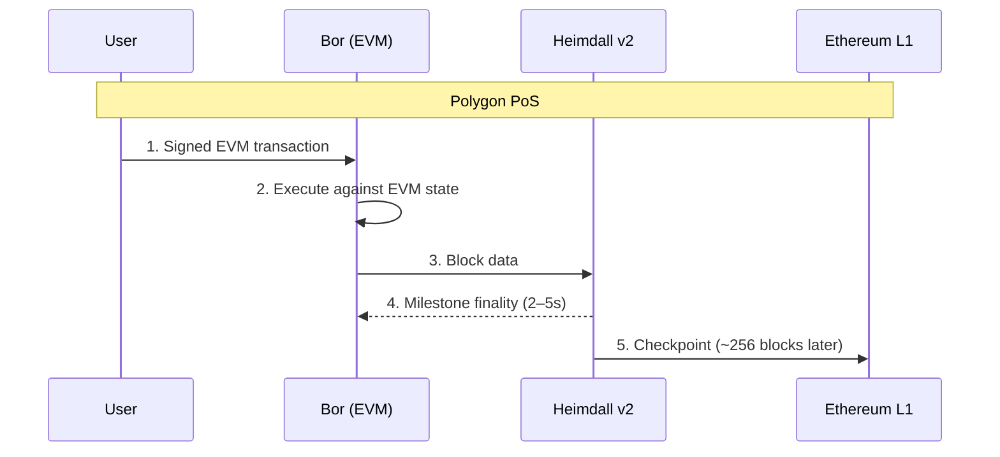

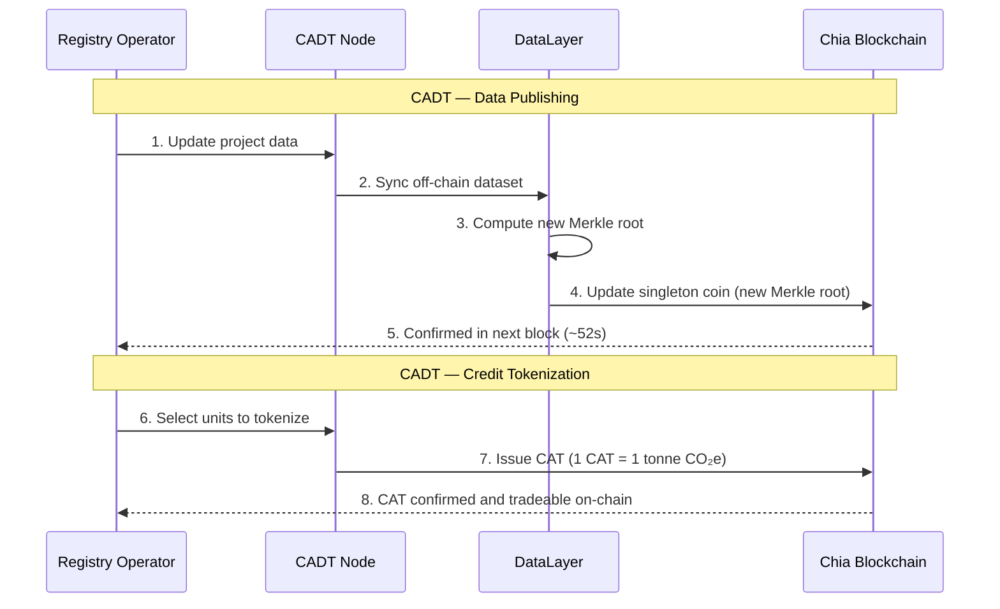

---

## 6. On-Chain Logic & Data Model

| Aspect | Hyperledger Fabric | Polygon PoS | CADT / Chia |
|---|---|---|---|
| **Contract Name** | Chaincode | Smart Contract | Chialisp puzzle |
| **Language** | Go, Node.js, Java | Solidity, Vyper | Chialisp (LISP dialect) |
| **Execution Model** | Off-chain simulation → on-chain commit | On-chain EVM execution on every validator | Coin puzzle evaluated at spend time |
| **Turing Complete?** | Yes | Yes (EVM) | No — intentionally conditions-based |
| **State Model** | Key-value World State (LevelDB / CouchDB) + immutable ledger log | Account model — storage slot mapping per contract | Coin/UTXO model — coins spent and recreated |
| **Concurrency** | MVCC — conflicts detected at commit; conflicting txs aborted | Sequential EVM execution per block | No shared mutable state; each coin is independent |
| **Privacy** | Private Data Collections; channel isolation | None natively — all state is public | Public by default; DataLayer access-controlled |

**On Chialisp's model**: Unlike Solidity's mutable account storage, every Chia asset is a **coin** with a puzzle (spending logic) and a solution (input provided at spend time). A coin is consumed when a valid solution is provided — not modified in place. This eliminates re-entrancy attacks by design, simplifies formal verification, and makes transaction outcomes fully deterministic before broadcast.

**On Fabric's World State**: The World State (current values) and the Ledger (full history) are stored separately. Rich JSON queries are supported via CouchDB. The ledger is immutable; the World State reflects the output of all committed transactions.

---

## 7. Identity & Access Control

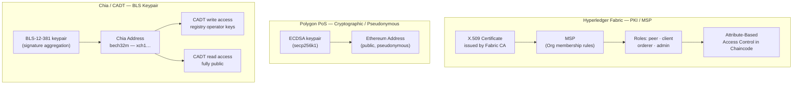

**Hyperledger Fabric** operates the strongest identity model of the three. Every actor must hold an X.509 certificate issued by a Certificate Authority registered in the network's MSP. There is no anonymous participation. Fine-grained Attribute-Based Access Control (ABAC) allows chaincode to enforce role-based permissions at the logic level — ideal for regulated industries requiring legally attributable audit trails.

**Polygon PoS** uses standard Ethereum cryptographic identity — a secp256k1 keypair where the address is derived from the public key. Participation is fully permissionless and pseudonymous. On-chain KYC or access control must be built at the application layer if required.

**Chia / CADT** uses BLS-12-381 signatures, which support signature aggregation — multiple signatures combined into a single compact proof, improving efficiency. The Chia blockchain is fully public. CADT read access is open to anyone. Write access (publishing registry data) requires keys held by authorized registry operators, enforced at the DataLayer node level.

---

## 8. Performance & Scalability

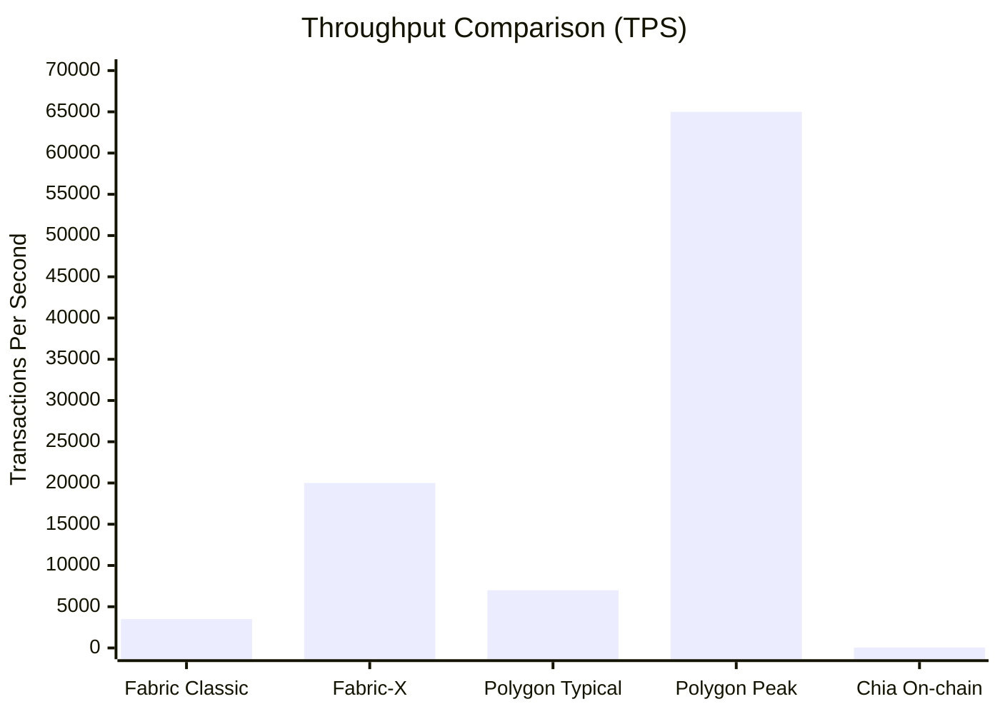

| Metric | Hyperledger Fabric | Polygon PoS | Chia / CADT |
|---|---|---|---|
| **Throughput** | ~3,500 TPS classic; 20,000+ Fabric-X | ~7,000 TPS typical; 65,000 theoretical | ~52 TPS on-chain |
| **Finality** | 1–2s (deterministic; no forks) | 2–5s milestone; ~30 min Ethereum checkpoint | ~52s block time |
| **Scalability Approach** | Channels; Fabric-X microservices + Arma BFT | AggLayer; Bhilai upgrade targeting 100k+ TPS by 2026 | DataLayer offloads bulk data; on-chain only stores hashes |
| **Primary Bottleneck** | MVCC conflict rate under high contention | 105-validator cap; no fraud/validity proofs on L1 | ~52s block time; timelord dependency |

**A note on CADT's throughput**: The ~52 TPS on-chain limit is not a practical bottleneck. CADT writes — registry data updates, tokenization events, retirements — are low-frequency by nature. The DataLayer architecture intentionally moves bulk data off-chain, using the blockchain only for cryptographic anchoring. This is the correct architectural trade-off for a climate data platform.

---

## 9. Token Economics

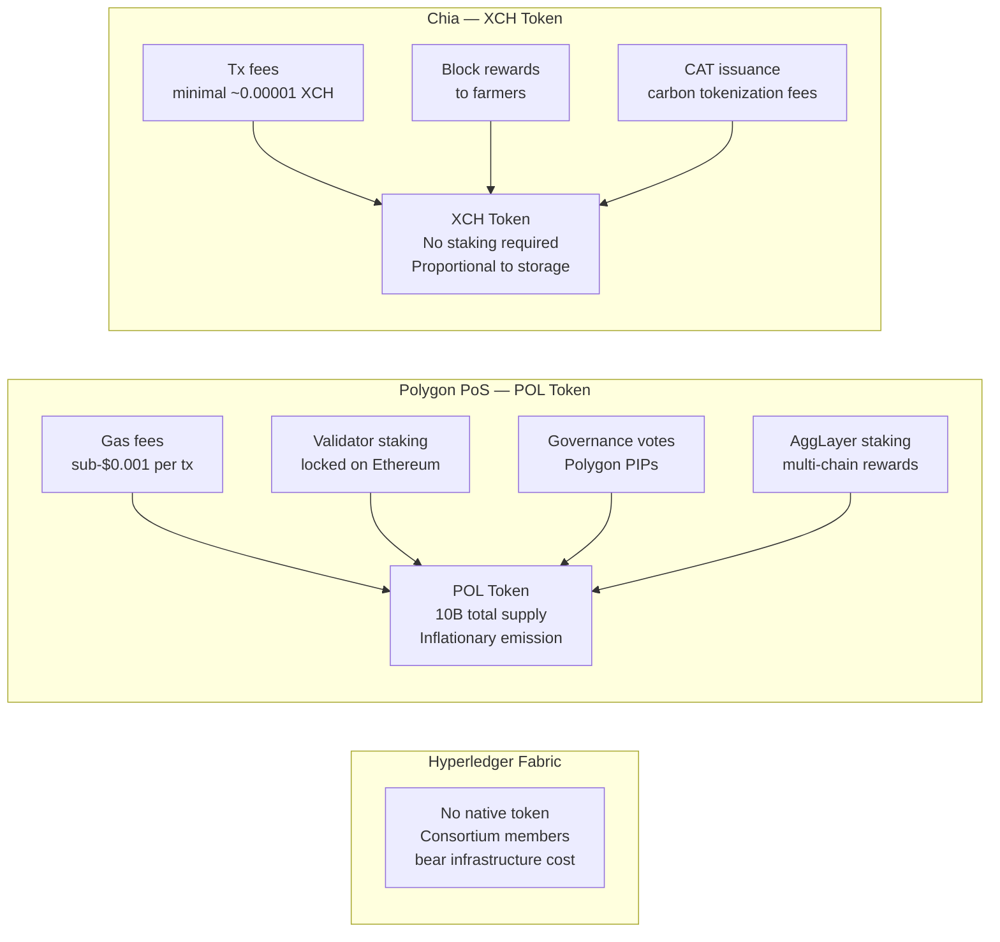

**Hyperledger Fabric** has no native token — a deliberate design choice for enterprise adoption. No cryptocurrency exposure, no volatile gas costs, no staking requirements. Network operation costs are distributed among consortium members as infrastructure expense.

**Polygon PoS (POL)** completed its MATIC-to-POL migration by September 2025. POL is described as "Hyperproductive" — it can be staked to secure not just Polygon PoS but also other chains in the AggLayer ecosystem, generating diversified validator rewards. Transaction fees are consistently sub-$0.001. Governance is exercised through Polygon Improvement Proposals (PIPs) by POL holders.

**Chia (XCH)** does not require staking. Farmers earn XCH through block rewards proportional to committed storage. CADT-related transactions (updating a singleton, issuing a CAT) cost fractions of an XCH. No minimum capital requirement to participate in network security.

---

## 10. Security Model

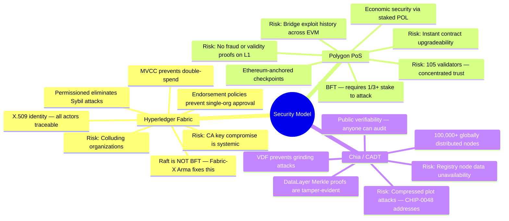

**Hyperledger Fabric**: The permissioned design eliminates anonymous Sybil attacks entirely. The principal systemic risk is CA key compromise — a corrupted Certificate Authority can issue fraudulent identities. Endorsement policies requiring multi-organization sign-off mitigate unilateral transaction manipulation. Classic Fabric's Raft ordering is **not** Byzantine Fault Tolerant; Fabric-X's Arma BFT addresses this for adversarial environments.

**Polygon PoS**: Economic security requires an attacker to acquire more than 1/3 of staked POL — a significant capital cost. However, the active set is capped at 105 validators, making it more concentrated than fully permissionless chains. Critically, **Ethereum L1 does not verify the correctness of state transitions** — it only checks that a checkpoint is signed by 2/3+ validators. A colluding supermajority could theoretically submit invalid state. There are no fraud proofs or ZK validity proofs. L2Beat classifies this as a medium trust assumption.

**Chia / CADT**: With over 100,000 full nodes, Chia has one of the most decentralized node distributions of any blockchain. The VDF component of PoST makes grinding attacks prohibitively expensive — an attacker cannot try alternative proofs faster than real time allows. DataLayer Merkle anchoring means any data tampering by a registry node is immediately detectable by comparing off-chain data against the on-chain hash.

---

## 11. Interoperability

| Capability | Hyperledger Fabric | Polygon PoS | CADT / Chia |
|---|---|---|---|
| **EVM Compatible** | ❌ | ✅ Full | ❌ |
| **Cross-chain bridges** | Limited (Cactus toolkit) | ✅ PoS Bridge, LayerZero, Axelar, Connext | Limited; CATs bridgeable via custom logic |
| **L2-to-L1 asset movement** | N/A | ✅ via PoS Bridge (~30 min) | N/A |
| **Interop vision** | Fabric-X namespaces; Hyperledger Cactus | AggLayer — unified cross-L2 ZK proof to Ethereum | Cross-registry carbon data harmonization |
| **Off-chain integration** | Excellent (REST gateway, event listeners, DB connectors) | Event listeners, The Graph, oracles | REST API per CADT node; DataLayer subscriptions |
| **Industry standards** | GS1, ISO 20022, IATA | ERC-20/721/1155, EIP standards | Article 6 (Paris Agreement), UNFCCC MRV standards |
| **Real-world integrations** | IBM Food Trust, SWIFT, CBDC pilots | Visa, Meta, Stripe | World Bank, IETA, Verra, Gold Standard, ACR |

**AggLayer** is Polygon's most ambitious interoperability initiative — a unified aggregation layer that accepts ZK proofs from multiple sovereign chains and submits a single combined proof to Ethereum, enabling trustless L2-to-L2 transfers without routing through L1.

**CADT's interoperability** is specifically cross-registry, not cross-chain. Its value lies in harmonizing siloed, incompatible carbon registries under a common data model — a problem no EVM-based solution currently addresses with live production deployments.

---

## 12. Environmental Impact

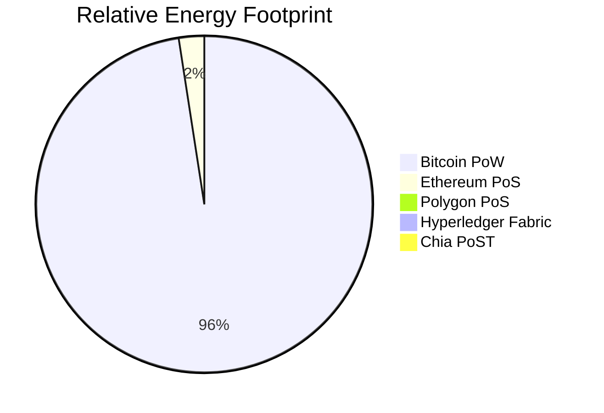

| Platform | Why It's Efficient |
|---|---|
| **Hyperledger Fabric** | No mining. No competitive staking compute. Only conventional server infrastructure in a small, known consortium. |
| **Polygon PoS** | Delegated PoS eliminates mining. 105 validators running standard server nodes. ~99% more efficient than Proof of Work. |
| **Chia (CADT)** | Hard drives idle between block challenges. No ongoing compute race. VDF runs on commodity hardware. ~1/600th the energy footprint of comparable blockchains per Chia Network. |

Chia's PoST is the greenest Layer-1 architecture in production. The fact that CADT — a **carbon market** platform — chose the greenest blockchain is not coincidental. A platform whose purpose is reducing greenhouse gas emissions operating on an energy-intensive chain would be a fundamental contradiction.

---

## 13. Ecosystem & Adoption

### Hyperledger Fabric

Fabric holds ~46% of enterprise permissioned blockchain deployments globally (Hyperledger Foundation, 2025). Key deployments include IBM Food Trust (food supply chain traceability), TradeLens (global shipping), we.trade (SME trade finance), and multiple CBDC research programs. Major cloud vendors — AWS Managed Blockchain, Azure Blockchain Service, Oracle Blockchain Platform — offer managed Fabric. Fabric-X signals continued investment from IBM Research and the Linux Foundation through 2025 and beyond.

### Polygon PoS

One of the largest public Web3 ecosystems with thousands of deployed dApps. DeFi protocols including Aave, Uniswap, QuickSwap, and Curve operate on Polygon with combined TVL in the billions. Enterprise integrations in 2025: **Visa** integrated Polygon for global stablecoin settlement; **Meta** uses Polygon for USDC creator payments in Colombia and the Philippines; **Stripe** uses Polygon for payment infrastructure. Top validators include Binance, Coinbase, Twinstake, and Luganodes.

### CADT on Chia

CADT is early-stage in broad market adoption but carries the strongest institutional backing of the three for its domain. It is the **reference implementation** for Article 6 of the Paris Agreement's digital MRV (Measurement, Reporting, Verification). Live integrations span Verra (VCS), Gold Standard, American Carbon Registry (ACR), and Climate Action Reserve (CAR). The first tokenized carbon credit transactions executed in 2023 between the Carbon Opportunities Fund and Sumitomo Corporation of Americas. Chia Network completed SOC 2 Type II certification in September 2025. The network operates over 100,000 nodes globally.

---

## 14. Use-Case Fit Matrix

| Use Case | Fabric | Polygon PoS | CADT / Chia |
|---|---|---|---|
| Enterprise supply chain | ✅ Best fit | ⚠️ Possible | ❌ |
| CBDC / regulated digital payments | ✅ Best fit | ⚠️ Compliance layer needed | ❌ |
| DeFi — lending, DEX, yield | ❌ No token / no ecosystem | ✅ Best fit | ⚠️ CAT swaps only |
| NFTs / digital collectibles | ❌ Not typical | ✅ Best fit | ⚠️ Possible |
| Carbon credit registry | ❌ No public verifiability | ⚠️ No domain tooling | ✅ Best fit |
| Carbon credit tokenization | ❌ | ⚠️ Possible (custom build) | ✅ Best fit |
| Cross-registry data harmonization | ❌ | ❌ | ✅ Only live option |
| Article 6 / Paris Agreement MRV | ❌ | ❌ | ✅ Designed for this |
| Consortium data sharing | ✅ Best fit | ⚠️ Possible | ⚠️ CADT is a narrow form |
| Public permissionless transactions | ❌ Impossible | ✅ | ✅ |
| High-frequency on-chain trading | ❌ | ✅ | ❌ |
| GameFi / on-chain gaming | ❌ | ✅ Best fit | ❌ |
| Long-term immutable audit trails | ✅ | ⚠️ | ✅ DataLayer |
| No cryptocurrency exposure | ✅ | ❌ Requires POL | ❌ Minimal XCH needed |
| Government / sovereign deployment | ✅ | ⚠️ | ✅ World Bank governed |

---

## 15. Decision Guide

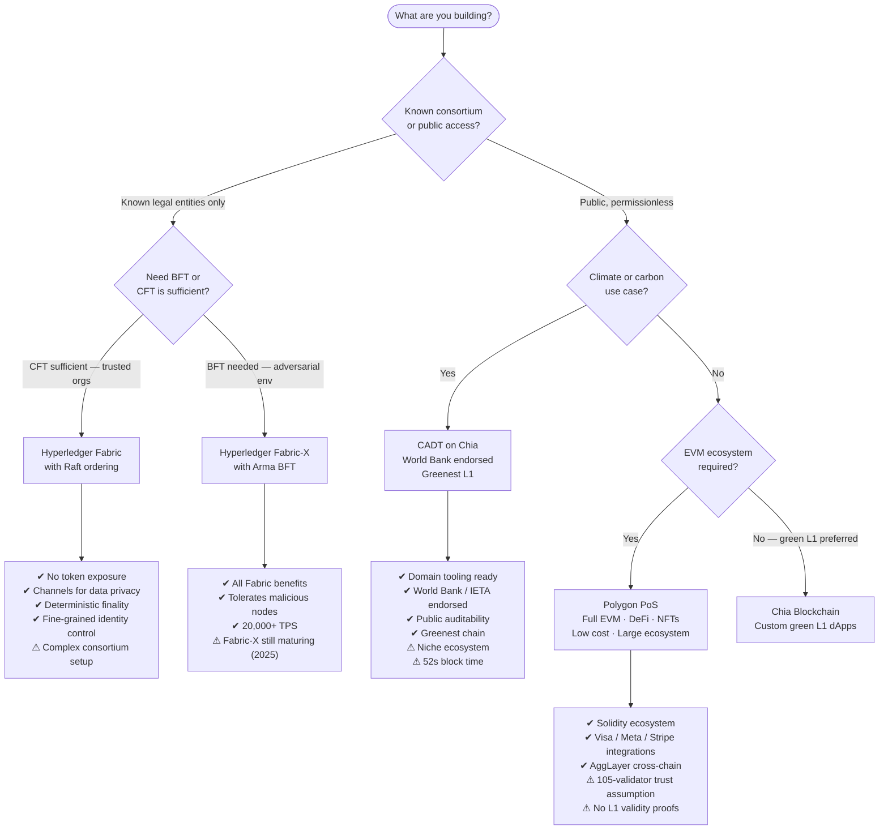

**Choose Hyperledger Fabric when** participants are known legal entities, cryptocurrency exposure is unacceptable, privacy between organizations is mandatory, and you operate in a regulated industry. Accept higher operational complexity in exchange for fine-grained control.

**Choose Polygon PoS when** you need full EVM compatibility, a large existing ecosystem, low transaction fees, and permissionless public access — for DeFi, NFTs, gaming, or enterprise payment rails. Accept the 105-validator trust assumption and POL token dependency.

**Choose CADT on Chia when** your application is a carbon market, climate registry, or Article 6 compliance tool. CADT provides ready-made domain infrastructure, World Bank and IETA governance alignment, cross-registry harmonization out of the box, and the greenest L1 in production. Accept a niche ecosystem and ~52s on-chain block time (which is not a practical bottleneck for this domain).

---

## 16. Glossary

| Term | Definition |
|---|---|
| **MSP** | Membership Service Provider — Fabric's identity framework mapping X.509 certificates to organizational membership |
| **Chaincode** | Fabric's smart contract; deployed per-channel, runs in a Docker/Kubernetes sandbox |
| **Raft** | Crash Fault Tolerant consensus; assumes honest majority; no Byzantine tolerance |
| **BFT** | Byzantine Fault Tolerant — tolerates up to 1/3 of nodes being actively malicious |
| **Arma BFT** | Fabric-X's new BFT consensus; pipelined, partitioned ordering; 15,000+ TPS |
| **MVCC** | Multi-Version Concurrency Control — detects read/write conflicts at Fabric commit time |
| **Heimdall** | Polygon's consensus layer (CometBFT); all 105 validators participate |
| **Bor** | Polygon's EVM execution layer (Go-Ethereum fork); rotating subset of validators produces blocks |
| **Milestone** | Polygon-internal finality event (2–5s); does not anchor to Ethereum |
| **Checkpoint** | Merkle root of Bor blocks submitted to Ethereum L1; required for asset withdrawals to L1 |
| **POL** | Polygon's native token (replaced MATIC 2024); used for gas, staking, and governance |
| **AggLayer** | Polygon's cross-chain aggregation layer — unifies multiple chains under a shared ZK proof to Ethereum |
| **PoST** | Proof of Space and Time — Chia's consensus; uses hard drive storage + Verifiable Delay Function |
| **VDF** | Verifiable Delay Function — sequential computation requiring minimum real-world elapsed time; prevents block grinding |
| **Plot** | Pre-computed cryptographic lookup table stored on a farmer's hard drive; the unit of space commitment in Chia |
| **Singleton** | Unique on-chain Chia coin lineage used to anchor DataLayer Merkle root hashes |
| **CAT** | Chia Asset Token — fungible token standard; one CAT = one tonne CO₂e in carbon market use |
| **DataLayer** | Chia's hybrid on/off-chain decentralized database; data off-chain, Merkle root on-chain |
| **CADT** | Climate Action Data Trust — carbon registry harmonization platform built on Chia by World Bank, IETA, Singapore |
| **Chialisp** | Chia's on-chain programming language; LISP-based, conditions-driven, not Turing-complete |
| **CHIP-0048** | Chia Improvement Proposal for next-generation Proof of Space; introduces Quality Chain to resist compression attacks |

---

*Last updated: May 2026 · Sources: Hyperledger Foundation, Polygon Developer Docs (docs.polygon.technology), Chia Network, L2Beat, World Bank CADT documentation, IBM Research (Fabric-X), Messari*
